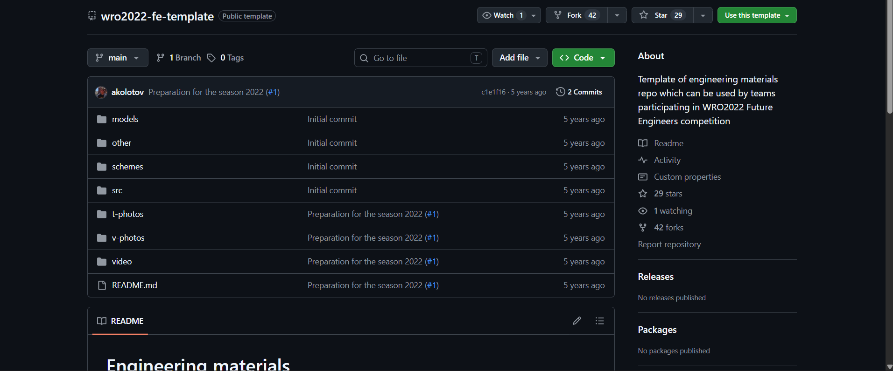
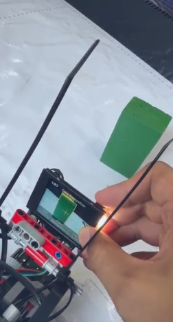

# Entry 10 - Working on Challenge v2 & Setting up github template

Yo! So for this journal entry, I worked on making the github repository as part of the requirements for submitting it to WRO.

Main objective of this session was working on the challenge run. Main bug of this session was the fact that the shade of green was being confused with the white mat. We tried so hard to fix that but to no avail.

Then I tried using the line tracking on the robot. Unfortunately, it doesn't work consistently so I don't think we can use that.

All of it was just calibrating, testing, and crying and make it work. You can check the full 3h timelapse. It's pretty harrd to watch hahahaha. But anyways, I think we'd have to think how to make that shade of green work with what we have.

I've also changed the gears so that it doesn't make any funny sound

I've also changed the gears so that it doesn't make any funny sound     
# Entry 11 - Working on the challenge run v3

For this session, I was able to do LOTS of the challenge run. Locking in is crazy.

But most of the things that I did was calibrating the values of the robot so that it could successfully do the challenge run.

First thing I did when coming into the training was to try training the huskylens with the colors again. I tried seeing  if putting aluminum foil underneath would not make it reflect (as tarpaulin does have a tendency to reflect). And yeah, AMAZINGLY DID WORK!

Second was actually testing it. Main problem with this one though is the fact that it wasn't consistent with differentiating the color on the mat with the color of the bricks. So what I did was set an aspect ratio to check if the aspect ratio of the shape is like of the brick's. That way, it filters out the colors in the mat.

And yeah lastly, was all about calibrating the stuff there. Calibrating the turns and such. I

Two tests i wanna see:

The green block first
The red block first

Then once those two tests are done. Then perhaps it may prove the robot as sufficient for the challenge run.

Parallel parking and consecutive color bricks will come later!

Right now, its just me and my team calibrating the runs.
