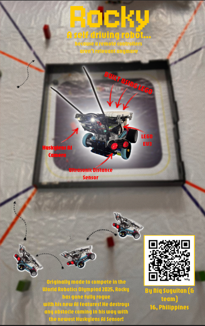

# Pagtingin / WRO Robotics Journal

---

## Entry 1 — May 26, 2026 (11:03 PM)

We started working on our WRO competition robot, “Rocky.” Before competing in nationals, we focused on building a basic navigation system using Pybricks.

Initial pseudo-flow:

* If both sides detect walls → move straight
* If a wall is missing on one side → turn accordingly
* Resume straight once alignment is restored
* Use colored lines to count laps
* Repeat until 3 laps are completed

---

## Entry 2 — May 29, 2026 (9:26 AM)

We worked on making the robot complete at least one full lap around the WRO mat.

My task was coding the movement logic, but we faced issues with the robot drifting due to unstable front wheel alignment. Despite multiple code adjustments, the issue persisted, so we eventually decided to rebuild the physical structure.

---

## Entry 3 — June 1, 2026 (10:06 PM)

We focused on the WRO challenge where the robot must turn left or right depending on brick colors (red or green).

I successfully implemented detection for at least two bricks and tuned calibration values repeatedly to improve accuracy.

---

## Entry 4 — June 3, 2026 (9:36 PM)

We worked on the Open Challenge for WRO, which required completing three laps with randomly placed inner track walls.

I implemented a basic control system based on documentation and performed multiple calibration tests during the run.

---

## Entry 5 — June 4, 2026 (10:17 PM)

We encountered a critical issue where the robot could not flash programs correctly and was stuck during startup.

We tried multiple fixes:

* Restarting EV3 and laptop
* Removing batteries for a hard reset
* Using another laptop

Interestingly, the issue also transferred between devices. After investigation, it was suspected to be a filesystem corruption issue. Eventually, we fixed it using the Pybricks beta installer without needing an SD card.

This restored full programming functionality.

---

## Entry 6 — June 8, 2026 (6:23 PM)

We continued debugging robot behavior issues.

Main problems:

* Robot failing to detect diagonal wall approaches
* Blind spots causing collisions instead of turns

Proposed solution:

* Add dual ultrasonic sensors on the sides

We also began work on improving parallel parking behavior, but calibration was still ongoing.

---

## Entry 7 — June 9, 2026 (9:00 PM)

We successfully used the Pybricks beta environment to program the robot again.

However, wall detection still needed improvement, especially in diagonal approaches where the ultrasonic sensor failed.

We also continued refining parallel parking behavior. The open run challenge was mostly working, and part of the color challenge had been implemented.

---

## Entry 8 — June 13, 2026 (10:05 PM)

We attended a dry run hosted by another school and tested the robot on the actual WRO mat.

We were unable to fully complete the challenge run code, but implemented a workaround using area detection from the HuskyLens output.

Logic used:

* Compute detected color area
* Determine dominant color
* If white dominates → go straight
* Otherwise → turn left

We still have not implemented full color brick detection.

Current progress estimate: **~65% complete**

---

## Entry 9 — (Latest Entry)

We continued refining the challenge run code.

A new color detection method was added:

* Detect black regions
* Extract x-coordinates from detection
* Use position data to decide turning behavior

We also plan to implement a **state machine system** so the robot can switch between behaviors depending on what it detects (e.g., navigation vs. obstacle avoidance vs. color reaction).

Currently, the same HuskyLens setup supports both Open Run and Challenge Run, which is a major advantage.

Next steps:

* Refine Open Run stability
* Improve color detection for challenge bricks
* Implement full state machine architecture

# Entry 10 - Working on Challenge v2 & Setting up github template

Yo! So for this journal entry, I worked on making the github repository as part of the requirements for submitting it to WRO.

Main objective of this session was working on the challenge run. Main bug of this session was the fact that the shade of green was being confused with the white mat. We tried so hard to fix that but to no avail.

Then I tried using the line tracking on the robot. Unfortunately, it doesn't work consistently so I don't think we can use that.

All of it was just calibrating, testing, and crying and make it work. You can check the full 3h timelapse. It's pretty harrd to watch hahahaha. But anyways, I think we'd have to think how to make that shade of green work with what we have.

I've also changed the gears so that it doesn't make any funny sound

I've also changed the gears so that it doesn't make any funny sound     
# Entry 11 - Working on the challenge run v3

For this session, I was able to do LOTS of the challenge run. Locking in is crazy.

But most of the things that I did was calibrating the values of the robot so that it could successfully do the challenge run.

First thing I did when coming into the training was to try training the huskylens with the colors again. I tried seeing  if putting aluminum foil underneath would not make it reflect (as tarpaulin does have a tendency to reflect). And yeah, AMAZINGLY DID WORK!

Second was actually testing it. Main problem with this one though is the fact that it wasn't consistent with differentiating the color on the mat with the color of the bricks. So what I did was set an aspect ratio to check if the aspect ratio of the shape is like of the brick's. That way, it filters out the colors in the mat.

And yeah lastly, was all about calibrating the stuff there. Calibrating the turns and such. I

Two tests i wanna see:

The green block first
The red block first

Then once those two tests are done. Then perhaps it may prove the robot as sufficient for the challenge run.

Parallel parking and consecutive color bricks will come later!

Right now, its just me and my team calibrating the runs.

# Entry 12 - Submission

Okay so now it's time for me to submit.

So as you can see in the demo it's not yet really up to the functionality. We rlly tried to make it do the challenge but we'll tweak it next week @ the competition.

I've mainly made the zine and submitting other requirements.

Also made a mistake with the timelapse. I made it join one of the timelapses of Pagtingin project (me designing the zine)

Anyways, pretty proud of how this turned out into!

I know I didn't do much of the building cuz I mostly coded this. But yeah, it was enjoyable to say the least!

