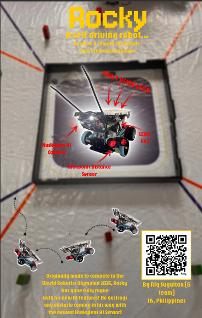
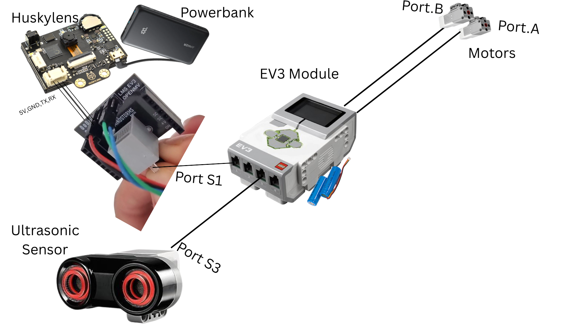

# Rocky

## Project Aims

A self-driving robot...

because remote controllers aren't relevant anymore.

Welcome to the first ever self-driving car you'll see... or not.

This is a project to be used to compete in the upcoming World Robotics Olympiad 2026 Future Engineers Category. Last year, we used distance sensors and we absolutely DID NOT win with that. So now we're integrating the Huskylens AI Camera to win.

Hopefully, I'll be able to take this project out way beyond just the competition. 

This robot only completes these two tasks as of right now, according to the WRO 2026 Future Engineers Rulebook:

- Open Challenge: The vehicle must complete three (3) laps on the track with random placements
of the inside track walls.
- Obstacle Challenge: The vehicle must complete three (3) laps on the track with randomly placed
green and red traffic signs. The traffic signs indicate the side of the lane the vehicle must follow.
The traffic sign to keep to the right side of the lane is a red pillar. The traffic sign to keep to the
left side of the lane is a green pillar. The vehicle should not move any of the traffic signs. After
the robot completed the three rounds, it has to find the parking lot and has to perform parallel
parking.

So not much features for a self-driving car. Someday, maybe?

## Zine Page

## System Overview

The robot consists of several modules:

* Sensing Module
* Power Module
* Motors
* Main Controller

These modules communicate together to provide sensing, processing, and actuation necessary for autonomous movement.

## Schematic

## CAD

There is no cad as this is completely built using lego!

Here are pictures of the robot for your reference though:

Image 1. Front of robot 

Image 2.Top of robot

Image 3. Side 1 of robot

Image 4. Side 2 of robot

Image 5. Bottom of the robot

## Make one yourself!

Want to build your own self-driving robot?

### 1. Decide on your chassis!

I'll give you the creative freedom here! Decide a chassis depending on what you want! It can be lego, 3D printed or anything!

### 2. Assemble the frame

Mount the motors, wheels, and battery holder onto the chassis.

### 3. Build the electronics

* Sensing Module (which consists of the ultrasonic and Huskylens AI Camera)
* Power Module (Which consists of two lithium ion batteries + a powerbank for the Huskylens AI Camera)
* Motors (which consists of two motors)
* Main Controller (which is only an EV3)

Feel free to build them around the chassis!
### 4. Flash the firmware

Upload the software (challenge_run.py) to the EV3 brick using Py Bricks beta! And let's see it work.

### 5. Start experimenting!

Tune the control algorithms, add more sensors, and teach the robot how to navigate.

Because no self-driving robot is ever truly finished.

## BOM

[BOM](BOM.csv)

## Support

For questions, suggestions, or collaborations, feel free to contact the engineer:

* Github: @Niqtan
* Slack User: @Niq
* Email: [niqban123@gmail.com](mailto:niqban123@gmail.com)

Thank you for checking out **Rocky**.

*A self-driving robot.*

*because remote controllers aren't relevant anymore.*
